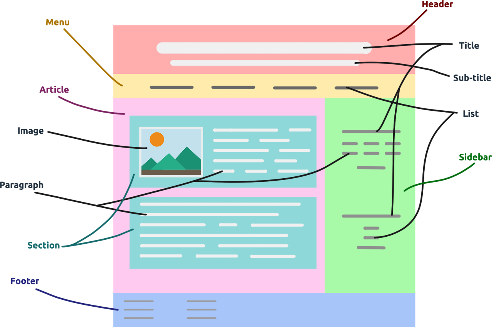

## **<ins>접근성을 고려한 웹 페이지 레이아웃 연습</ins>**

 

    

 

**목표 : <ins>웹 접근성과 각 각의 태그의 특성을 고려하여 페이지의 header를 구성한다.</ins>**

어쩌면 매우 간단해보이는 header이지만 각 각의 태그의 특성과 접근성을 고려해서 레이아웃을 구성한다면 생각보다 고려해야 될 부분이 많은 것 같다. 브라우저간의 호환성 문제를 고려하여 classic한 방식과 modern한 방식을 사용하여 레이아웃 구성을 연습한다.
 

# **Project Status**

🗓️ 2021.02.25(Thu)  

**(1) Issue1)** header의 전체 프레임 만들기  
→ [https://github.com/LeeHyungi0622/layout-practice-considering-accessibility/issues/1](https://github.com/LeeHyungi0622/layout-practice-considering-accessibility/issues/1)  

**(2) Issue2)** header의 member section 완성하기  
→ [https://github.com/LeeHyungi0622/layout-practice-considering-accessibility/issues/2](https://github.com/LeeHyungi0622/layout-practice-considering-accessibility/issues/2)  

**(3) Issue3)** header의 navigation 프레임 만들기  
→ [https://github.com/LeeHyungi0622/layout-practice-considering-accessibility/issues/3](https://github.com/LeeHyungi0622/layout-practice-considering-accessibility/issues/3)  

**(4) Issue4)** navigation의 menu부분 만들기 
→ [https://github.com/LeeHyungi0622/layout-practice-considering-accessibility/issues/4](https://github.com/LeeHyungi0622/layout-practice-considering-accessibility/issues/4)  

 

## **Screen shots**

<table>
    <tr>
        <td>
            
        </td>
    </tr>
    <tr>
        <td align="center"><b>header 구성 handwriting</b></td>
    </tr>
</table>
